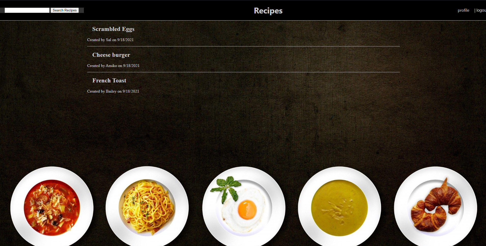

<br />
  <h1 align="center">Recipe Blog</h1>

<p align="center">
    A place for users to share recipes aswell as rate and review others recipes.
    <br />
    <a href="https://github.com/hoofmonger/RecipeBlog"><strong>Explore the docs »</strong></a>
    <br />
    <br />
    <a href="https://github.com/hoofmonger/RecipeBlog">View Demo</a>
    ·
    <a href="https://github.com/hoofmonger/RecipeBlog/issues">Report Bug</a>
    ·
    <a href="https://github.com/hoofmonger/RecipeBlog/issues">Request Feature</a>
</p>


<details open="open">
  <summary><h2 style="display: inline-block">Table of Contents</h2></summary>
  <ol>
    <li>
      <a href="#about-the-project">About The Project</a>
      <ul>
        <li><a href="#built-with">Built With</a></li>
      </ul>
    </li>
    <li>
      <a href="#getting-started">Getting Started</a>
      <ul>
        <li><a href="#prerequisites">Prerequisites</a></li>
        <li><a href="#installation">Installation</a></li>
      </ul>
    </li>
    <li><a href="#contributing">Contributing</a></li>
    <li><a href="#license">License</a></li>
    <li><a href="#contact">Contact</a></li>
    <li><a href="#acknowledgements">Acknowledgements</a></li>
  </ol>
</details>


## About The Project



### Built With

* Javascript
* HTML
* CSS
* Node.js
* Express.js
* MySQL
* bCrypt


## Getting Started

To get a local copy up and running follow these simple steps.

### Prerequisites

This is an example of how to list things you need to use the software and how to install them.
* npm
  ```sh
  npm install npm@latest -g
  ```

### Installation

1. Clone the repo
   ```sh
   git clone https://github.com/hoofmonger/RecipeBlog.git
   ```
2. Install NPM packages
   ```sh
   npm install
   ```


## Contributing

Contributions are what make the open source community such an amazing place to be learn, inspire, and create. Any contributions you make are **greatly appreciated**.

1. Fork the Project
2. Create your Feature Branch (`git checkout -b feature/AmazingFeature`)
3. Commit your Changes (`git commit -m 'Add some AmazingFeature'`)
4. Push to the Branch (`git push origin feature/AmazingFeature`)
5. Open a Pull Request


## License

[](https://opensource.org/licenses/MIT)
Distributed under the MIT License.


## Contact

* Bailey Bennett - baileyb227@gmail.com
* Zackary Davis - jantrezac95@gmail.com
* James Hoofard - james.hoofard.iii@gmail.com


Project Link: [https://github.com/hoofmonger/RecipeBlog](https://github.com/hoofmonger/RecipeBlog)
